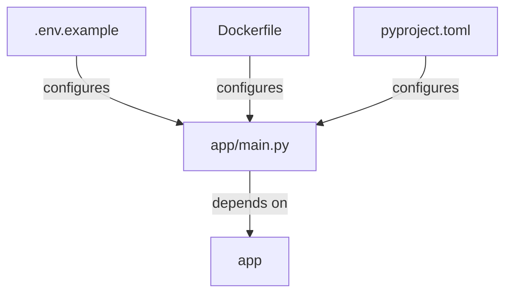

# Repo Flow

python-app looks like a Python, Docker, GitHub Actions project with FastAPI clues. The main code seems to live in app, and the likely starting point is app/main.py.

## Detected Entrypoints
- app/main.py

## Major Modules
- app

## Dependency Flow
- `app/main.py` appears to fan into app.
- Runtime setup is shaped by .env.example, Dockerfile, pyproject.toml.
- Framework clues suggest a FastAPI-style application layout.
- Environment configuration likely starts in .env.example.

## Start Here
- app/main.py
- README.md
- pyproject.toml
- Dockerfile
- .env.example

## Diagram

